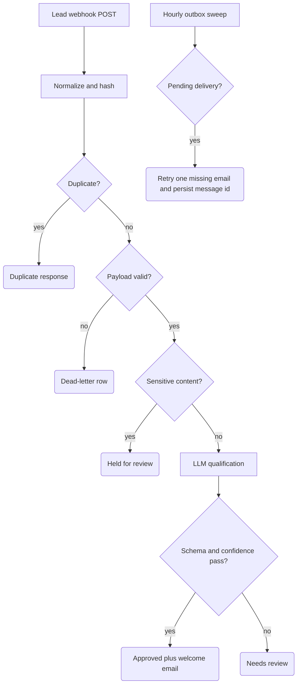

# Lead Intake with AI Qualification

Takes inbound lead submissions from a website form (or any HTTP source), deduplicates them, screens for sensitive content, classifies each lead with an LLM, persists everything to Airtable, and notifies the back office. Built for SME service businesses where enquiries arrive unevenly and either wait days in an inbox or get lost entirely.

## What it does

- **Trigger:** `POST` webhook (`Lead Intake Webhook`) accepting `name`, `company`, `email`, `process_hurts` plus common field aliases.
- `Normalize Intake` validates the payload (email format, message length bounds), computes a deterministic `submission_id = sha256(email + message)`, and flags sensitive content (credential-, payment-, health/legal-looking text) via regex before anything else runs.
- `Claim Submission` + `Find Existing Lead` deduplicate: replays get a `duplicate` JSON response with the existing record id — no second row, no second email.
- Invalid payloads go down a dead-letter branch (`Build Dead Letter Record` → Airtable) instead of being dropped; dead letters are themselves deduplicated.
- Sensitive submissions are held as `Needs Review` (`Build Sensitive-Held Record`) with an ops alert email — the LLM is never called on them.
- Clean leads hit `Extract Lead Qualification` (gpt-4o-mini): category, company size, urgency, budget signal, summary, welcome message, confidence.
- `Validate AI and Build Record` re-validates the model output; the record lands in Airtable as `Approved` or `Needs Review`.
- **Durable email outbox:** every accepted lead is stored with `Delivery State = PENDING_SEND` and both delivery flags false before Gmail runs. A flag changes only after Gmail returns a non-empty provider message id. The hourly `Lead Outbox Reconciliation Sweep` finds pending Airtable rows and retries the next missing welcome or alert delivery.
- **Outcomes:** approved leads get a test welcome email plus an ops alert; review cases get an ops alert only. The webhook response is returned only after the attempted delivery is confirmed in Airtable; a failed send remains recoverable by the scheduled sweep.

## Flow

## Design decisions

- **Idempotency by stable key.** The dedup key is a hash of email + message content, not an execution id, so retries and double-submits collapse to one record. Dedup is two-layer: an in-workflow claim store (`Claim Submission`, with a 15-minute stale-claim takeover) plus an Airtable lookup fallback that survives restarts.
- **Sensitive-content gate before the model.** `Sensitive Held?` routes flagged text to a human queue without ever sending it to OpenAI.
- **AI output is untrusted input.** `Validate AI and Build Record` parses defensively (code-fence stripping, shape probing), enforces closed enums with alias mapping, clamps confidence to [0,1], and substitutes a safe fallback welcome message. Low confidence (< 0.75), schema violations, or unparseable output all demote the lead to `Needs Review` — a state transition, not a blocking wait.
- **Injection hygiene on both boundaries.** User text is tag-redacted before it enters the LLM prompt (`ai_prompt_needs`), and every value rendered into an email body goes through dedicated HTML-escaped `*_html` fields.
- **Persist, confirm, reconcile.** `Create Lead Record` / `Create Sensitive Record` write the outbox state before any email. Each confirmation Code node rejects a Gmail result without a provider message id, then the matching Airtable update records `Welcome Message ID` or `Alert Message ID` and advances `Delivery State`. The scheduled sweep uses those durable fields rather than the workflow claim store to decide what is still missing.
- **Dead-letter path with its own dedup** (`Find Existing Dead Letter` → `Dead Letter Duplicate?`), so garbage input is auditable, not silent, and can't pile up duplicate rows.

## Setup

1. Import `workflow.json` into n8n (it imports inactive).
2. Credentials: **Airtable** (token), **OpenAI**, **Gmail OAuth**.
3. Create an Airtable base/table with the columns mapped in `Create Lead Record` (Submission ID, Status, Category, Confidence, etc.). Include `Delivery State`, `Welcome Sent`, `Alert Sent`, `Welcome Message ID`, and `Alert Message ID`, then update the base id and table name in every Airtable node.
4. Replace the `ops@example.com` placeholder in all Gmail nodes with your back-office address, and change the webhook `path` to your own value.
5. Test safely: keep the workflow unpublished and use the n8n **test webhook URL** with `curl -X POST ... -d '{"name":"...","company":"...","email":"...","process_hurts":"..."}'`. The welcome email intentionally goes to the ops address, not the submitter — repoint it only after you've reviewed live behavior.

## Limits

- The welcome email is sent to your ops inbox for review, not to the lead — going truly lead-facing is a deliberate config change, not a toggle this template makes for you.
- Gmail send and the following Airtable confirmation are not one transaction. If Gmail succeeds but the Airtable update fails, the row remains pending and the sweep can send a duplicate. Provider message ids make the delivered state auditable, but they are not a cross-system exactly-once guarantee.
- The in-workflow claim store is best-effort, not an atomic lock: two identical submissions landing in the same instant can race past it (the Airtable lookup covers normal sequential replays).
- The intake webhook intentionally has no token authentication (it backs a public form). Before exposing it to the public internet, add rate-limiting at the proxy or n8n level, or spam bots will fill your base with junk.
- Intake is webhook-only. Reading an email inbox as a source, CRM integration, and non-email alert channels are out of scope here.
