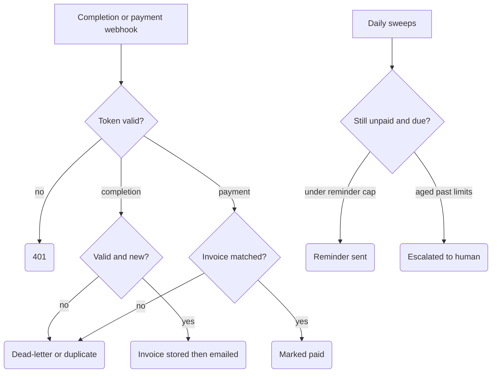

# Invoice Dunning (idempotent, atomic stop-on-paid)

Turns a "job completed" event into a tracked invoice, chases payment with a capped sequence of reminders, compare-and-set claims each still-unpaid row before sending, and escalates genuinely stuck invoices to a human. Built for SME service businesses that invoice after the work is done and lose cash flow to invoices nobody remembers to chase.

## What it does

- **Completion webhook** (`Job Completion Webhook`): token-checked, then `Normalize Completion Event` validates the event, prices it from a fixed in-workflow price book with VAT math, and derives `invoice_key = sha256("invoice.v1\n" + job_id)` for valid completions. Optional onboarding scope is accepted only as an exact 64-hex `onboarding_id` plus a bounded `smoke_tag`; both fields are persisted while the business invoice key stays unchanged. Non-completion events (orders, bookings) are acknowledged and ignored. Invalid payloads become `Dead Letter` rows under the separate deterministic identity `sha256("invoice.dead.v1\n" + raw request JSON)`, so they cannot occupy a valid invoice key.
- The invoice row is inserted into an n8n Data Table as `Invoice Pending Email` **before** the email goes out, then updated to `Invoice Sent` with the message id after `Send Controlled Invoice Email`.
- **Payment webhook** (`Payment Webhook`): token-checked, claims each payment event once, matches it to the invoice row, and marks it `Paid` (`Build Paid Update` → `Update Invoice Paid`). Supplied valid owner and/or tag fields narrow the match on exactly those dimensions, and exactly one row must remain. An integration that omits both scope fields remains compatible only when the invoice key has exactly one candidate row; multiple scopes are ambiguous and go to the human queue rather than selecting an arbitrary row. Unknown or ambiguous invoices are persisted in `Dunning_Unmatched_Payments` before the webhook returns `payment_unmatched_human_queue`; normal replays reuse the same deterministic queue key. If exactly one scoped invoice appears while the payment claim is still inside its 15-minute window, a replay re-resolves that row and runs the normal paid update; an already-`Paid` row remains a duplicate with no write. The earlier unmatched queue row remains as a human-review receipt and is not automatically reconciled.
- **Daily dunning sweep** (schedule, 09:15): picks `Invoice Sent` rows past `next_nudge_due_at`, sends at most 3 reminders per invoice, and pushes the next due date out after each send.
- **Daily escalation sweep** (schedule, 09:35): invoices over the high-value threshold aged 14+ days, or with 3 reminders sent and aged 21+ days, get a human-review alert and land in `Escalated` — no further reminders.

## Flow

## Design decisions

- **Auth fails closed.** Both webhooks compare a header token (`x-dunning-token` or `Bearer`) against the `DUNNING_WEBHOOK_TOKEN` n8n variable and return 401 before any lookup or side effect — including when the server-side variable itself is missing.
- **No AI near money or recipients.** Amounts come only from the hard-coded price book (with per-service quantity bounds); there are no model nodes anywhere in the flow.
- **Onboarding uses the same contract.** Workflow 08 emits a complete `job.completed` event with completed status, deterministic job/event identity, client identity and verified email, mapped service code, quantity, exact `onboarding_id`, and server-owned `smoke_tag`. Its predicted invoice key uses the exact formula above, so this normalizer's `real_invoice_key` and `invoice_key` match it byte-for-byte. Completion claims and persistent duplicate checks use the exact invoice-key/owner/tag triple.
- **Two-layer idempotency per side effect.** Every irreversible action has a stable key (`invoice_key` for standalone invoices, scoped by owner/tag when present; likewise for payment, reminder, and escalation actions), guarded by an in-workflow claim store (15-minute stale takeover) plus a persistent Data Table lookup. Invalid completions bypass that valid-invoice claim store and deduplicate persistently under their dead-letter identity. Legacy blank-scope valid keys keep their prior shape. Dunning and escalation rechecks match invoice key, owner, and tag exactly, so one fixture scope cannot suppress or mutate another. Replaying a sweep after success produces zero due actions.
- **Stop-on-paid guard with compare-and-set.** The dunning query only selects `Invoice Sent` rows, `Build Dunning Recheck Decision` re-reads each row at send time, and the claim update compares `id`, the expected status, and the previous `last_nudge_claim_key` before replacing only the action key. The invoice remains in its eligible status, so an email failure cannot strand it in a pending state. The final update again compares the expected status and claimed action key; a concurrent payment can change the row to `Paid`, but a stale dunning or escalation update can no longer overwrite it. An update that matches zero rows emits zero items, so Gmail is not reached after a claim miss.
- **Persist before send.** Rows exist in a durable state before any email fires; if the insert fails, no email is sent. Every Data-Table lookup used as a gate has `alwaysOutputData` so a missing row can't hang the webhook.
- **Dead-letter path.** Invalid completions are stored with `last_error_class`/`last_error_message` instead of being dropped.

## Setup

1. Import `workflow.json` into n8n (it imports inactive; keep it that way while testing).
2. Credentials: **Gmail OAuth**. Create an n8n **Data Table** matching the column schema in `Insert Invoice Pending Email` (including string columns `invoice_key`, `onboarding_id`, and `smoke_tag`, plus status, nudge count, due dates, payment fields, ...) and a `Dunning_Unmatched_Payments` table matching `Insert Unmatched Payment Queue Row`, including the same owner/tag scope; update the table ids in all Data Table nodes.
3. Set the `DUNNING_WEBHOOK_TOKEN` variable (Settings → Variables; requires an n8n plan with Variables support) and send it as `x-dunning-token` from your job/payment systems.
4. Edit the constants at the top of `Normalize Completion Event` — `PRICE_BOOK` entries, `VAT_RATE`, currency, and first-nudge delay — plus the thresholds in both `Build Due ... Actions` nodes, to match your business.
5. Replace `ops@example.com` in all three Gmail nodes. All emails deliberately go to that single controlled inbox; the client address is stored on the record but never used as a recipient. Test each branch with `curl` against the test webhook URLs (completion, replayed completion, payment, garbage payload) before pointing recipients anywhere real.

### Migration from versions that stored invalid completions under valid invoice keys

Before activating this version, export and audit existing `Dead Letter` rows in `Dunning_Invoices`. For each row whose `invoice_key` equals `sha256("invoice.v1\n" + job_id)`, re-key `invoice_key` to `sha256("invoice.dead.v1\n" + raw_event_json)` (where `raw_event_json` is the exact stored request JSON), preserving the row's existing owner/tag fields. Then remove the matching legacy `<old invoice_key>\n<onboarding_id>\n<smoke_tag>` entry from the workflow's global `invoice_claims` static data with a controlled one-time maintenance run. Export both the table rows and static data before changing them. If the exact raw JSON is unavailable, quarantine or export-and-delete the stale dead-letter row instead of guessing a key; do not alter valid invoice rows. A corrected completion can be replayed only after both the stale table identity and matching static claim are cleared.

## Limits

- It does **not** issue a legal invoice. It renders invoice HTML and tracks state; a real invoicing provider (accounting software API) must be wired in for compliant documents.
- The email send is not transactional with the final Data Table update: if that update fails after a successful send, the claim store suppresses immediate replays for 15 minutes, after which the same reminder can be retried and duplicated. The row stays sweep-eligible instead of becoming permanently stranded.
- The in-workflow claim store and the unmatched-payment find-then-insert check are not atomic distributed locks; truly simultaneous identical requests can race them. The persistent lookup covers normal sequential retries and replays, not every concurrent delivery.
- **Scope migration:** add empty-default `onboarding_id` and `smoke_tag` columns before importing this version. Existing standalone rows remain in the blank scope. Never assign a historical onboarding tag without the authoritative original request: a tagged parent deliberately ignores legacy untagged evidence. Untagged payment callbacks still succeed when the invoice key identifies exactly one row; callbacks with only one scope field must resolve uniquely after that filter; otherwise the callback remains in human review.
