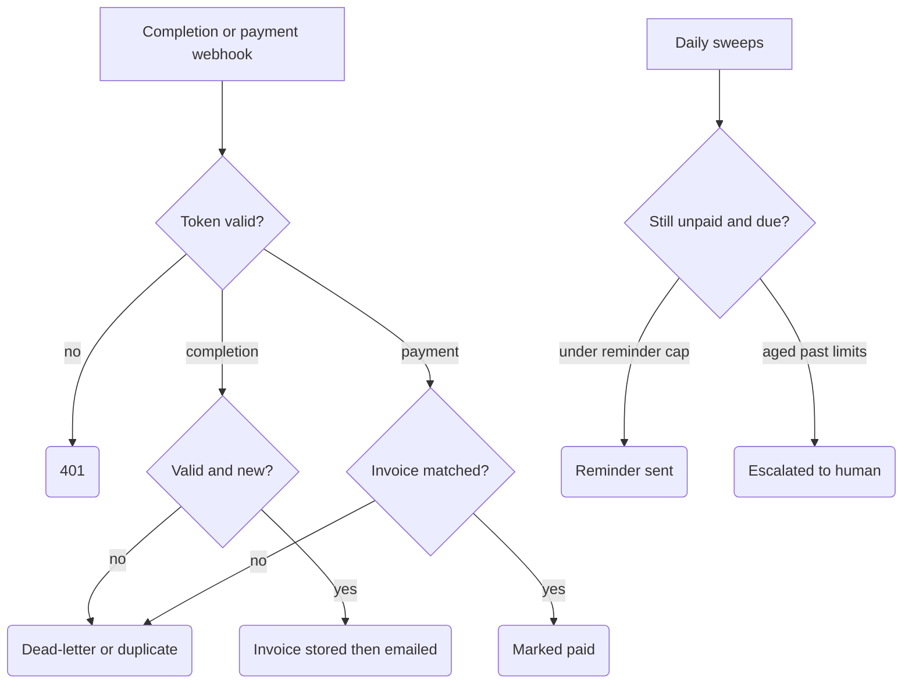

# Invoice Dunning (idempotent, stop-on-paid)

Turns a "job completed" event into a tracked invoice, chases payment with a capped sequence of reminders, checks for payment right before every send (best-effort stop-on-paid — the recheck and the send are not one atomic step, see Limits), and escalates genuinely stuck invoices to a human. Built for SME service businesses that invoice after the work is done and lose cash flow to invoices nobody remembers to chase.

## What it does

- **Completion webhook** (`Job Completion Webhook`): token-checked, then `Normalize Completion Event` validates the event, prices it from a fixed in-workflow price book with VAT math, and derives `invoice_key = sha256(job_id)`. Non-completion events (orders, bookings) are acknowledged and ignored; invalid payloads become `Dead Letter` rows.
- The invoice row is inserted into an n8n Data Table as `Invoice Pending Email` **before** the email goes out, then updated to `Invoice Sent` with the message id after `Send Controlled Invoice Email`.
- **Payment webhook** (`Payment Webhook`): token-checked, claims each payment event once, matches it to the invoice row, and marks it `Paid` (`Build Paid Update` → `Update Invoice Paid`). Unknown invoices return `payment_unmatched_human_queue`; repeats return `already_paid_or_duplicate`.
- **Daily dunning sweep** (schedule, 09:15): picks `Invoice Sent` rows past `next_nudge_due_at`, sends at most 3 reminders per invoice, and pushes the next due date out after each send.
- **Daily escalation sweep** (schedule, 09:35): invoices over the high-value threshold aged 14+ days, or with 3 reminders sent and aged 21+ days, get a human-review alert and land in `Escalated` — no further reminders.

## Flow

## Design decisions

- **Auth fails closed.** Both webhooks compare a header token (`x-dunning-token` or `Bearer`) against the `DUNNING_WEBHOOK_TOKEN` n8n variable and return 401 before any lookup or side effect — including when the server-side variable itself is missing.
- **No AI near money or recipients.** Amounts come only from the hard-coded price book (with per-service quantity bounds); there are no model nodes anywhere in the flow.
- **Two-layer idempotency per side effect.** Every irreversible action has a stable key (`invoice_key` for invoices, `invoice_key:paid:event_id` for payments, `invoice_key:nudge:N` / `invoice_key:escalate:human` for reminders), guarded by an in-workflow claim store (15-minute stale takeover) plus a persistent Data Table lookup. Replaying a sweep after success produces zero due actions.
- **Stop-on-paid guard, twice.** The dunning query only selects `Invoice Sent` rows, and `Build Dunning Recheck Decision` re-reads each row from the Data Table at send time and drops anything `Paid`, carrying `paid_at`, `Escalated`, or already at the planned reminder number — so a payment landing mid-cadence kills the next reminder.
- **Persist before send.** Rows exist in a durable state before any email fires; if the insert fails, no email is sent. Every Data-Table lookup used as a gate has `alwaysOutputData` so a missing row can't hang the webhook.
- **Dead-letter path.** Invalid completions are stored with `last_error_class`/`last_error_message` instead of being dropped.

## Setup

1. Import `workflow.json` into n8n (it imports inactive; keep it that way while testing).
2. Credentials: **Gmail OAuth**. Create an n8n **Data Table** matching the column schema in `Insert Invoice Pending Email` (invoice_key, status, nudge_count, next_nudge_due_at, paid_at, ...) and update the table id in all Data Table nodes.
3. Set the `DUNNING_WEBHOOK_TOKEN` variable (Settings → Variables; requires an n8n plan with Variables support) and send it as `x-dunning-token` from your job/payment systems.
4. Edit the constants at the top of `Normalize Completion Event` — `PRICE_BOOK` entries, `VAT_RATE`, currency, and first-nudge delay — plus the thresholds in both `Build Due ... Actions` nodes, to match your business.
5. Replace `ops@example.com` in all three Gmail nodes. All emails deliberately go to that single controlled inbox; the client address is stored on the record but never used as a recipient. Test each branch with `curl` against the test webhook URLs (completion, replayed completion, payment, garbage payload) before pointing recipients anywhere real.

## Limits

- It does **not** issue a legal invoice. It renders invoice HTML and tracks state; a real invoicing provider (accounting software API) must be wired in for compliant documents.
- The email send is not transactional with the Data Table update: if the update fails after a successful send, the claim store suppresses immediate replays for 15 minutes, but production use should add a reconciliation sweep for stranded `... Pending ...` rows.
- The in-workflow claim store is not an atomic distributed lock; truly simultaneous identical webhook POSTs can race it (the persistent lookup covers normal retries and replays).
