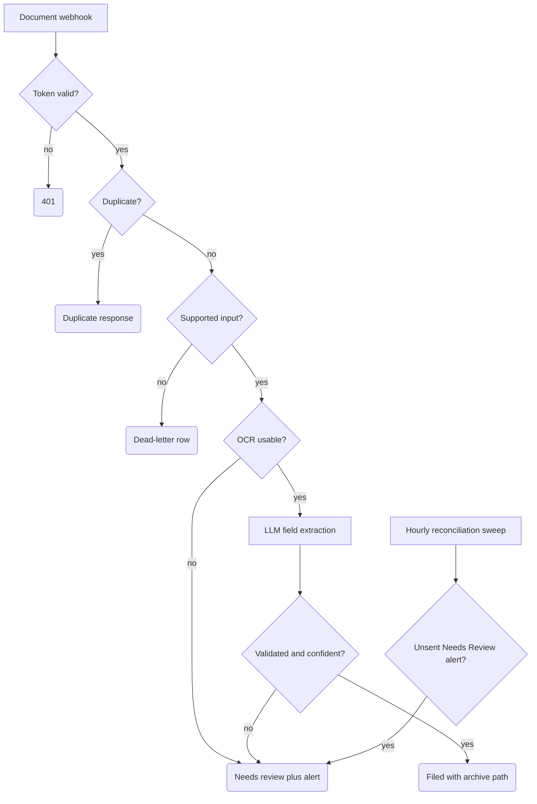

# Document Intake with AI Classification

Accepts inbound documents (scans and PDFs with OCR text already extracted), classifies them with an LLM — Invoice / Contract / Receipt / Other — validates the model output, and either files the document under a deterministic archive path or routes it to a human review queue with an email alert. Built for SME back offices (accounting firms, small legal practices, any business where attachments arrive daily and someone sorts them by hand).

## What it does

- **Trigger:** `POST /document-intake-test` with attachment metadata + OCR text. A token check (`Validate Intake Token`) fails closed with 401 before any lookup or side effect.
- **Normalize + dedup:** `Normalize Document Intake` computes a stable document key (SHA-256 of the file hash, or attachment id + filename + MIME type). A two-layer duplicate check (`Claim Document Key` in-flow, then `Find Existing Document Row` against the Data Table) means replays get a duplicate response instead of a second row.
- **Early rejects:** unsupported input goes to a dead-letter row (`Insert Document Dead Letter`); unreadable or low-confidence OCR goes to review (`Insert OCR Needs Review`) *before* any model call.
- **AI extraction:** `Extract Document Fields` (OpenAI) receives only a redacted OCR excerpt and a sanitized filename, and is asked for JSON with closed enums.
- **Outcomes:** validated, high-confidence results are recorded as `Filed` with a logical archive path; everything else lands in `Needs Review`, and a review alert email goes to the ops address. The hourly `Document Review Alert Reconciliation Sweep` retries `Needs Review` rows whose `review_alert_sent` flag is still false.

## Flow

## Design decisions

- **AI output is untrusted.** `Validate AI Extraction` parses the model's text (including fenced/nested JSON), then re-validates every field — enums, confidence ranges, required fields. Nothing the model says reaches the database unchecked.
- **Closed taxonomy with an escape hatch.** Allowed types are `Invoice`, `Contract`, `Receipt`, `Other`. Any out-of-enum value is coerced to `Other`, and `Other` always requires human review — the model cannot invent a category.
- **Confidence gating, asymmetric by design.** Auto-filing requires overall confidence ≥ 0.82 plus per-field thresholds (type, party, date, amount), a concrete currency for invoices/receipts, and `needs_human_review !== true`. A misfiled document is worse than an unfiled one, so every borderline case goes to review.
- **PII minimization before the prompt.** Emails, phone numbers, IBANs, and tax/national ID numbers are redacted from the OCR text and the filename before the model sees them; the excerpt is truncated to 6,000 characters and raw sender/body fields are never forwarded.
- **Filename sanitization.** Archive paths are built from lowercase, character-whitelisted segments (`safeFilename` / `safeParty` in `Validate AI Extraction`) — a user-supplied filename cannot inject path separators or traversal sequences.
- **Durable alert reconciliation.** Review rows are inserted with `review_alert_sent=false` before Gmail runs. Both intake alert paths and the scheduled retry path require a non-empty Gmail provider message id before recording `review_alert_sent=true`; the reconciliation update also compares the unsent flag and never rewrites document status.

## Setup

1. In n8n: **Workflows → Import from File** → `workflow.json`.
2. Create a Data Table for document state and re-select it in every Data Table node (the import references a table named `Intake_Documents`; column names follow the insert nodes).
3. Set the variable `DOC_INTAKE_WEBHOOK_TOKEN` in your n8n instance (note: runtime `$vars` requires a plan that supports variables).
4. Attach an OpenAI credential to `Extract Document Fields` and your Gmail credential to all alert nodes, then replace `ops@example.com` with your own ops inbox.
5. **Safe test:** `POST` a sample payload with the `x-doc-intake-token` header. The workflow only writes Data Table rows and emails your ops address; no files are moved. Note that the redacted OCR excerpt is sent to OpenAI for extraction — review that against your data-processing requirements before feeding real documents in. Try a garbage-OCR payload and a duplicate replay to see the review and dedup paths.

## Limits

- It does **not** poll a mailbox or run OCR. It expects a payload where text extraction has already happened; wiring a mail intake + OCR provider in front of the webhook is your integration work.
- Filing is **logical only**: the workflow stores an `archive_path` string. It does not move files to Drive, SharePoint, or S3 — add a storage node after the `Filed` insert for that.
- Gmail send and the following Data Table update are not transactional. If Gmail succeeds but the update fails, the row remains unsent and a later sweep can send a duplicate; the provider message id is durable evidence, not an exactly-once guarantee. Overlapping sweeps can have the same limitation.
- The duplicate claim is a best-effort replay guard, not an atomic lock. Two simultaneous same-key requests can race; use an external queue or a store with a unique-key constraint if you need hard concurrency guarantees.
