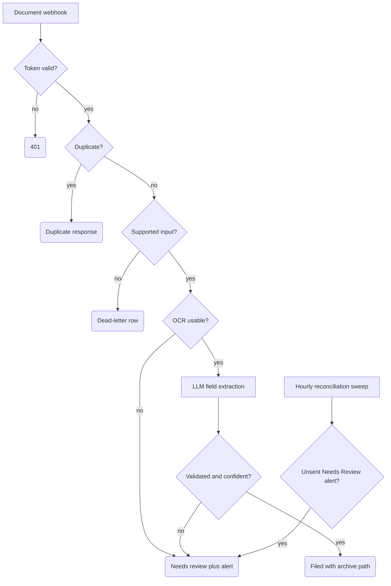

# Document Intake with AI Classification

Accepts inbound documents (scans and PDFs with OCR text already extracted), classifies them with an LLM — Invoice / Contract / Receipt / Other — validates the model output, and either files the document under a deterministic archive path or routes it to a human review queue with an email alert. Built for SME back offices (accounting firms, small legal practices, any business where attachments arrive daily and someone sorts them by hand).

## What it does

- **Trigger:** `POST /document-intake-test` with a filename, supported MIME type, attachment id or valid 64-hex file SHA-256, and non-empty OCR text (plus OCR confidence/scan-text ratio for usability gating). A token check (`Validate Intake Token`) fails closed with 401 before any lookup or side effect.
- **Normalize + dedup:** `Normalize Document Intake` computes a stable document key from the file hash or a versioned JSON serialization of attachment id, filename, and MIME type. Standalone requests keep the legacy owner scope; an owner-bound request scopes that key by its validated `onboarding_id`, while its bounded `smoke_tag` is a separate run-scope field and does not change the business document key. Processable requests use a two-layer duplicate check scoped by exact document key, owner, and tag: `Claim Document Key` is the best-effort in-flow guard, and `Find Existing Document Row` uses the Data Table as the historical replay layer. Permanently invalid dead-letter requests bypass the in-memory claim cache but still reach the Data Table lookup, so an identical malformed replay returns the existing invalid row instead of adding another. Unsupported MIME requests use a separate versioned invalid-document identity, so that dead-letter row cannot occupy the key later needed by a corrected supported-MIME request for the same file.
- **Early rejects:** non-string or overlong contract identifiers, malformed hashes, supplied OCR quality metrics that are not finite numbers in the closed range `[0,1]`, and unsupported input go to a dead-letter row (`Insert Document Dead Letter`) without entering or displacing the in-memory claim cache. The permanent dead-letter finalizer returns that inserted row without reading or mutating the claim cache: a normalized key cannot prove that the invalid request owns a same-key claim. Stale historical entries age out or are pruned only through the normal claim policy. Unreadable or low-confidence OCR with valid metric types goes to review (`Insert OCR Needs Review`) *before* any model call.
- **AI extraction:** `Extract Document Fields` (OpenAI) receives only a redacted OCR excerpt and a sanitized filename, and is asked for JSON with closed enums.
- **Outcomes:** validated, high-confidence results are recorded as `Filed` with a logical archive path; everything else lands in `Needs Review`, and a review alert email goes to the ops address. The hourly `Document Review Alert Reconciliation Sweep` retries `Needs Review` rows whose `review_alert_sent` flag is still false.

## Intake contract

| Field | Requirement | Key behavior |
| --- | --- | --- |
| `filename` | Required string, at most 180 raw characters | Participates in the attachment-based seed. |
| `mime_type` | Required supported MIME string, at most 120 raw characters | Participates in the attachment-based seed. |
| `ocr_text` | Required non-empty string | Used without object/array/number coercion; existing OCR size behavior is unchanged. |
| `ocr_confidence` / `ocrConfidence` | Optional; every supplied alias must be a finite JavaScript number in `[0,1]` | Missing defaults to numeric `0`. Strings, booleans, arrays, objects, `null`, `NaN`, infinities, and out-of-range numbers are permanent contract errors. |
| `scan_text_ratio` / `scanTextRatio` | Optional; every supplied alias must be a finite JavaScript number in `[0,1]` | Missing defaults to numeric `0`; the same fail-closed alias and type rules apply. |
| `file_sha256` | Optional string alternative to `attachment_id`; when supplied it must be exactly 64 hexadecimal characters | Normalized to lowercase and used as the document seed. |
| `attachment_id` | String at most 180 raw characters; required only when `file_sha256` is absent | Serialized with filename and MIME as `JSON.stringify(["attachment.v2", attachment_id, filename, mime_type])`. |
| `onboarding_id` | Optional; if present it must be a string containing exactly 64 hexadecimal characters | Valid strings are normalized to lowercase, returned, and persisted. A supplied invalid value stores an empty owner, receives a fingerprinted invalid-owner key, and is permanently dead-lettered before OCR/model routing. |
| `smoke_tag` | Optional string; when supplied it must start with an alphanumeric character, contain only alphanumerics, `.`, `_`, or `-`, and be at most 80 characters | Preserved exactly and persisted as run scope. A supplied invalid value is a permanent contract error and cannot occupy a valid tagged scope. |

Standalone requests with the owner field genuinely omitted retain `sha256("doc-intake\n" + document_seed)`. Valid owner-bound requests use `sha256("doc-intake\n" + onboarding_id + "\n" + document_seed)`. A valid file SHA-256 remains the seed unchanged; attachment requests use `JSON.stringify(["attachment.v2", attachment_id, filename, mime_type])`. An unsupported MIME instead uses `JSON.stringify(["invalid-document.v1", "unsupported_mime", mime_type, underlying_identity, invalid_contract_fingerprint])`, where `underlying_identity` is the unambiguous file-SHA, attachment-id/filename, or fingerprinted fallback tuple. Thus identical malformed requests retain one deterministic invalid key, while correcting only the MIME restores the unchanged valid SHA or attachment formula. Supplied-invalid owners use a separate deterministic `INVALID-OWNER` namespace containing only a SHA-256 fingerprint of the owner type/value; raw owner material is not placed in the key or stored ownership field. The normalized valid owner, or empty invalid/omitted owner, is stored on `Dead Letter`, `Filed`, AI `Needs Review`, and OCR `Needs Review` rows.

The validated tag, or an empty invalid/omitted tag, is persisted on those same four terminal paths. Claim and Data Table duplicate identity is the exact document-key/owner/tag triple; missing tag is never inferred as a match for a tagged request.

Aliases (`file_name`, `mimeType`, `attachmentId`, `sha256`, `text`, `extracted_text`) follow the same string and length rules. Any supplied alias with the wrong type fails the request even when another alias is valid. Malformed contract values use a fingerprinted invalid-contract key namespace and are permanently dead-lettered before model routing.

Existing attachment-id-only rows used the delimiter-based v1 seed. Let those requests finish or retire them before adopting this template; valid file-SHA-based document keys are unchanged. Before this invalid-key version, unsupported-MIME rows with a valid file SHA used that same valid SHA key, while unsupported attachment rows used the ordinary attachment seed. Re-key, quarantine, or retire those historical dead-letter rows before adoption; otherwise a corrected request can still encounter the legacy invalid row under its valid key. The first replay of an old malformed request may create one row under the new invalid namespace, after which its replays deduplicate normally.

## Flow

## Design decisions

- **AI output is untrusted.** Before parsing direct, fenced, or nested JSON text, `Validate AI Extraction` caps the extracted raw text at 12,000 characters, including whitespace and Markdown fence markers. This conservative ceiling is ample for the short classification metadata contract and is enforced before fence cleanup or structural work; over-limit text routes to review with a structural-scan-limit reason. Within that bound, an escape-aware structural scan rejects every duplicate decoded key in the same object scope. This includes identical values, conflicting values, escaped-equivalent names, and duplicates inside nested objects such as `field_confidence`; the same key may still appear in distinct object scopes. Duplicate-key output always routes to review instead of inheriting JavaScript's last-key-wins behavior. If an upstream integration has already converted the model response to an object, duplicate-key detection is no longer possible because that information has been discarded, so the node retains strict fail-closed schema validation for object inputs. Overall confidence and all four required field confidences must be finite JavaScript numbers in `[0,1]`; the field-confidence container must be a non-array object. Amount must be exactly `null` or a finite number in `[0,10000000]`, currency must be an exact string from the closed enum, and `needs_human_review` must be an explicit boolean. Missing, coerced, non-finite, or out-of-range values normalize to safe review values and cannot reach the filed branch.
- **Closed taxonomy with an escape hatch.** Allowed types are `Invoice`, `Contract`, `Receipt`, `Other`. Any out-of-enum value is coerced to `Other`, and `Other` always requires human review — the model cannot invent a category.
- **Confidence gating, asymmetric by design.** Auto-filing requires a completely valid typed AI schema, overall confidence ≥ 0.82, per-field thresholds (type, party, date, amount), a concrete currency for invoices/receipts, and exact `needs_human_review: false`. `true` always requests review; malformed or missing review decisions fail closed. Contracts may still use an explicit `amount_total: null`. A misfiled document is worse than an unfiled one, so every borderline case goes to review.
- **PII minimization before the prompt.** Emails, phone numbers, IBANs, and tax/national ID numbers are redacted from the OCR text and the filename before the model sees them; the excerpt is truncated to 6,000 characters and raw sender/body fields are never forwarded.
- **Filename sanitization.** Archive paths are built from lowercase, character-whitelisted segments (`safeFilename` / `safeParty` in `Validate AI Extraction`) — a user-supplied filename cannot inject path separators or traversal sequences.
- **Parent requests use this exact boundary.** Workflow 08 supplies the same fields consumed by `Normalize Document Intake`, including its 64-hex `onboarding_id` and server-owned `smoke_tag`, and predicts the owner-scoped `document_key` with the exact formula above. Raw OCR alone, missing filename/MIME/text/attachment identity, malformed hashes, and malformed owner ids remain non-dispatchable parent preconditions instead of entering this workflow with guessed metadata.
- **Durable alert reconciliation.** Review rows are inserted with `review_alert_sent=false` before Gmail runs. Both intake alert paths and the scheduled retry path require a non-empty Gmail provider message id before recording `review_alert_sent=true`; the reconciliation update also compares the unsent flag and never rewrites document status.

## Setup

1. In n8n: **Workflows → Import from File** → `workflow.json`.
2. Create a Data Table for document state and re-select it in every Data Table node (the import references a table named `Intake_Documents`; column names follow the insert nodes). Include optional string columns `onboarding_id` and `smoke_tag`; all four terminal insert schemas map both.
3. Set the variable `DOC_INTAKE_WEBHOOK_TOKEN` in your n8n instance (note: runtime `$vars` requires a plan that supports variables).
4. Attach an OpenAI credential to `Extract Document Fields` and your Gmail credential to all alert nodes, then replace `ops@example.com` with your own ops inbox.
5. **Safe test:** `POST` a sample payload with the `x-doc-intake-token` header. The workflow only writes Data Table rows and emails your ops address; no files are moved. Note that the redacted OCR excerpt is sent to OpenAI for extraction — review that against your data-processing requirements before feeding real documents in. Try a garbage-OCR payload and a duplicate replay to see the review and dedup paths.

## Limits

- It does **not** poll a mailbox or run OCR. It expects a payload where text extraction has already happened; wiring a mail intake + OCR provider in front of the webhook is your integration work.
- Filing is **logical only**: the workflow stores an `archive_path` string. It does not move files to Drive, SharePoint, or S3 — add a storage node after the `Filed` insert for that.
- Gmail send and the following Data Table update are not transactional. If Gmail succeeds but the update fails, the row remains unsent and a later sweep can send a duplicate; the provider message id is durable evidence, not an exactly-once guarantee. Overlapping sweeps can have the same limitation.
- The duplicate claim is a best-effort replay guard, not an atomic lock. Two simultaneous same-key requests can race; use an external queue or a store with a unique-key constraint if you need hard concurrency guarantees.
- **Scope migration:** add an empty-default `smoke_tag` column before importing this version. Existing standalone rows remain compatible in the blank scope. Do not infer or fabricate a tag for historical evidence: workflow 08 deliberately ignores an untagged document row for a tagged saga. Backfill only from an authoritative preserved request, or leave the parent step unresolved for human handling.
