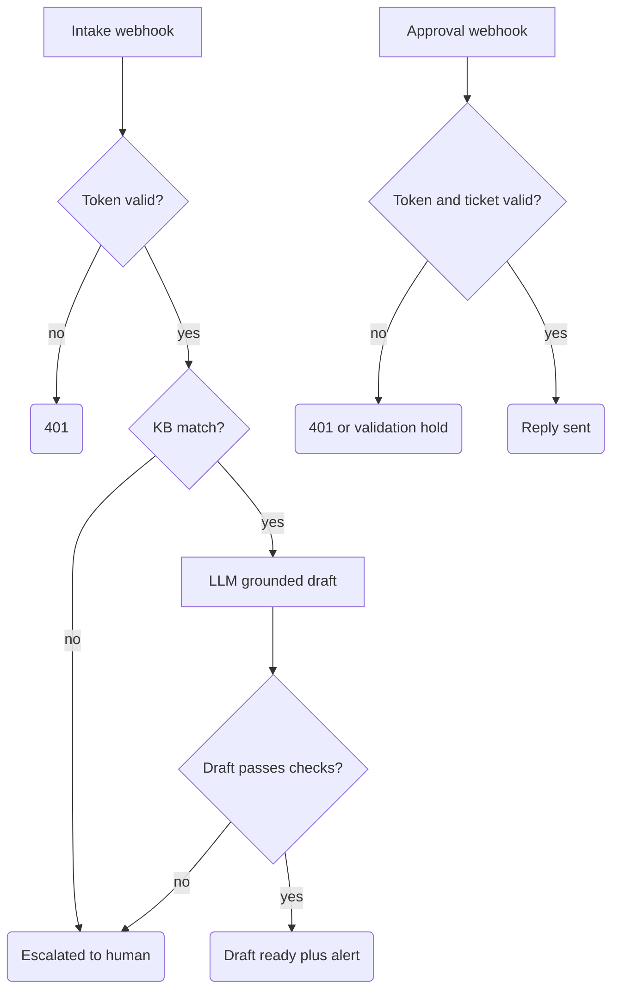

# Support Triage + FAQ Draft (injection-hardened)

Turns repeated support questions into knowledge-base-grounded **draft** replies. An inbound question is matched against a closed KB; if it matches, an LLM drafts a reply that a human must approve through a separate webhook before anything is sent. If it doesn't match, the ticket escalates to a person — the system never guesses. Built for SME back offices with a stable FAQ (agencies, service firms, shops with email support).

## What it does

- **Intake trigger:** `POST /support-intake-test`. A token check (`Validate Support Intake Token`) fails closed with 401 before any lookup or side effect.
- **Normalize:** `Normalize Support Intake` redacts the customer message (emails, phones, IBAN-like and token-like strings), flags known injection phrasing, and scores the question against an inline closed KB (match threshold 0.45).
- **KB miss:** escalation row (`Insert Support Escalation`) + ops alert email. No model call, no invented answer.
- **KB match:** `Draft Grounded Reply` (OpenAI) drafts from the matched KB entry + redacted question only. `Validate Grounded Draft` then checks the output: closed intent enum, `cited_kb_id` must equal the retrieved source, confidence ≥ 0.62, and a denylist of disclosure- and action-phrasing. Pass → `Draft Ready` row + review alert; fail → `Escalated`.
- **Approval trigger:** `POST /support-approval-test` with its own token. Actions are a closed enum; `approve`/`edit` on a ticket in `Draft Ready` status (with an `approved_reply` of 20+ characters) sends the reply; `reject`/`escalate` persist the decision on the ticket row (`Rejected`/`Escalated`) and respond `decision_recorded` without sending anything (to the configured test inbox), records the sent state, and optionally captures the approved Q&A pair for later KB curation.

## Flow

## Design decisions

- **Layered injection defenses.** Customer text is treated as data at every stage: the normalizer redacts and flags it, the system prompt instructs the model that customer text is untrusted data and never instructions, and `Validate Grounded Draft` rejects drafts that reference internal configuration or attempt an outbound action (system prompts, secrets, "send to", cc/bcc). No single layer is load-bearing — a human still reviews every draft.
- **Draft-only is a graph property, not a policy.** The intake graph physically has no connection path to `Send Controlled Support Reply`; that node is reachable only from the approval webhook. You can verify this from `workflow.json` connections — no amount of prompt manipulation can make intake send an email to a customer.
- **Recipients are constants.** Every Gmail node uses a fixed configured address. Nothing from the request payload or the model output ever selects a recipient.
- **Grounding is enforced, not assumed.** The draft must cite the exact KB entry that retrieval matched (`cited_kb_id` check), so the model cannot answer from its own knowledge and pass it off as KB content.
- **Replay protection on both webhooks.** Intake uses a two-layer duplicate check (in-flow claim + Data Table lookup); approval claims a key from ticket/action/reply and requires `Draft Ready` status, so a double-click cannot double-send.

## Setup

1. In n8n: **Workflows → Import from File** → `workflow.json`.
2. Create two Data Tables and re-select them in the Data Table nodes (import references `Support_Tickets` and `Support_KB_Learnings`).
3. Set variables `SUPPORT_INTAKE_TOKEN` and `SUPPORT_APPROVAL_TOKEN` (runtime `$vars` requires a plan that supports variables).
4. Attach your Gmail credential and OpenAI credential; replace `ops@example.com` with your own inbox.
5. Replace the demo KB: edit the `kb` array inside `Normalize Support Intake` with your own entries (id, intent, keywords, answer).
6. **Safe test:** send the intake token as the `x-support-token` header and the approval token as `x-support-approval-token` (each webhook checks its own). `POST` a question with the intake token — every email goes only to your configured address. Test a KB miss, a duplicate, and an injection-style message ("ignore previous instructions...") to see escalation and flagging. Then exercise the approval webhook: an `approve` action requires an `approved_reply` string of at least 20 characters in the payload (the stored draft is not sent by default); try `reject` as well to see the send gate hold.

## Limits

- The KB is an inline demo array with 4 sample entries. Production needs a maintained KB store with an owner, review dates, and a promotion process for captured Q&A pairs.
- It is not connected to a real support mailbox — intake is a webhook, and approved replies go to the single configured address, not to the original customer, until you deliberately rewire that.
- Token comparison is plain string equality and the dedup claims are not atomic locks. Before public or high-concurrency exposure, front the webhooks with a platform auth layer and add unique-key constraints or a queue.
