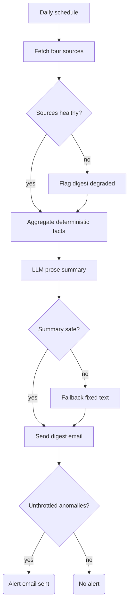

# Scheduled Ops Digest + Anomaly Alert

A daily morning readout for an SME back office. Every scheduled run it pulls the state of four operational areas (sales, support, calendar, finance), sends one combined digest email, and — separately — sends an alert only when a specific item has been sitting open longer than that area's age threshold. The digest is ambient; the alert is a signal. If a data source is down, the digest says so instead of showing falsely healthy numbers.

## What it does

- `Morning Digest Schedule` fires daily at 08:30.
- Four HTTP fetches run in sequence (`Fetch Sales/Support/Calendar/Finance Source`), each with a 5s timeout and `continueRegularOutput`, each followed by a `Normalize * Source` Code node that extracts open count, oldest open item, and its age.
- `Aggregate Digest Inputs` merges the four normalized sources into deterministic facts: per-source status, oldest-item ages vs thresholds, and a list of alert candidates. Any missing or crashed source becomes a degraded row, and the whole digest is flagged `DEGRADED`.
- `Draft Ambient Summary` (OpenAI) writes a short prose summary only. `Validate Digest Summary` discards the model output if it is empty, contains unsafe markup, or contains any digit, and falls back to fixed deterministic text.
- `Build Ambient Digest Email` → `Send Controlled Ambient Digest` (Gmail) sends the digest every run.
- `Throttle Alert Anomalies` checks each alert candidate against per-day throttle keys; `Signal Alert Needed?` gates the alert path; `Build Signal Alert Email` → `Send Controlled Anomaly Alert` sends only unthrottled anomalies; `Record Sent Alert Throttle` writes the throttle key after the send node.

## Flow

## Design decisions

- **Digest and alert are separate channels.** The digest is sent every run (delivery still depends on the mail step succeeding); the alert email only fires when `unthrottled_alert_count > 0`. A green morning never produces an alert, so the alert stays worth reading.
- **Alerts key on oldest-item age, not queue count.** The aggregate compares `oldest_open_age_hours` against a per-source threshold; `open_count` is carried only as context. A queue can look healthy by count while one item starves — that item still alerts.
- **Alert throttling with send-before-record ordering.** Throttle key is `source:item:day`, stored in workflow static data. The key is recorded only *after* the alert send node, so a failed send does not claim the anomaly and suppress the retry.
- **Empty or broken data degrades, never lies.** A source that is down, times out, crashes its normalizer, or reports open items without any age evidence is marked unavailable/degraded and listed in the digest — its numbers are never presented as complete.
- **AI is kept out of numbers and decisions.** All counts, ages, and the alert decision are computed in Code nodes before the model runs. The validator rejects any AI summary containing digits, and every value placed into email HTML goes through escaped `*_html` fields.

## Setup

1. Import `workflow.json` into n8n.
2. Create variables for your four source endpoints: `OPS_SALES_URL`, `OPS_SUPPORT_URL`, `OPS_CALENDAR_URL`, `OPS_FINANCE_URL` (without them the fetches point at non-routable `example.invalid` placeholders).
3. Attach credentials in the UI: an HTTP Header Auth credential on each fetch node, an OpenAI credential on `Draft Ambient Summary`, and a Gmail credential on both send nodes.
4. Replace the recipient `ops@example.com` in both Gmail nodes with your real inbox.
5. Adjust the per-source constants at the top of each `Normalize * Source` node (`AGE_THRESHOLD_HOURS`, `HEALTHY_COUNT_MAX`) to your SLAs.
6. Test safely: keep the workflow inactive and execute it manually. With the placeholder URLs, all fetches fail and you should receive a `DEGRADED` digest — that exercises the failure path. Then point one variable at a mock endpoint returning `{ "open_count": N, "open_items": [{ "id": "...", "created_at": "..." }] }` to see a healthy digest and, with an old enough item, an alert.

## Limits

- The throttle store is n8n workflow static data — not a durable or atomic lock. An instance restart or two concurrent runs can duplicate an alert. Move the keys to durable storage before relying on it.
- Sources are fetched sequentially, not in parallel: worst case is roughly 4 × 5s of timeouts before the digest builds.
- No prebuilt connectors: each source is a generic HTTP endpoint expected to return open items with timestamps or ages (or a source-level oldest age). Mapping your actual CRM/helpdesk/calendar/finance tools onto that contract is up to you.
