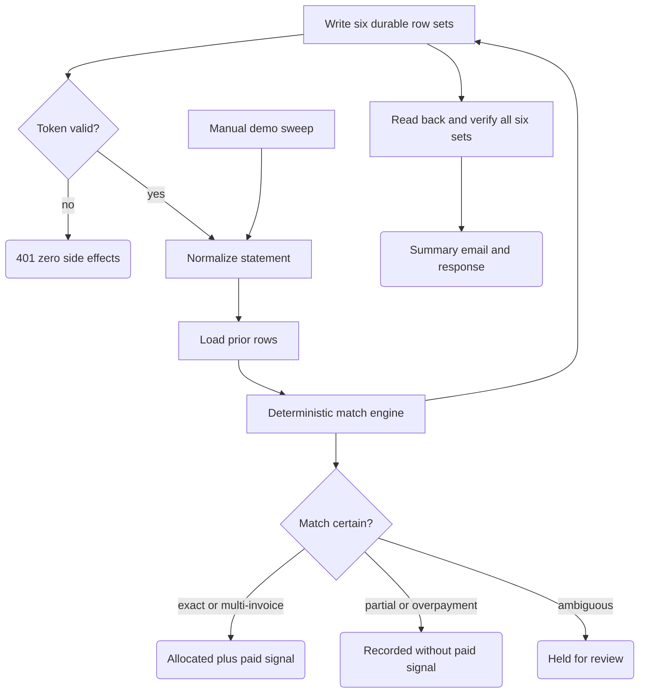

# Bank Payments to Invoice Reconciliation

Takes an imported bank statement and matches each incoming payment against open invoices — the weekly "who paid for what" chore in an SME back office. Where the match is certain, it records the allocation and emits a "paid" signal that a dunning/reminder workflow can consume to stop chasing that client. Where it is not certain, it does not guess: the payment is held in a review queue with the candidate invoices and the reason, and a human decides.

## What it does

- Two entry points: `Import Webhook` (POST with statement JSON) and `Runtime Simulator Sweep` (manual trigger with a built-in fixture for safe demo runs).
- `Validate Import Token` checks a token header against the `BANK_IMPORT_TOKEN` variable before anything else; `Import Authorized?` routes failures to a 401 response with zero side effects. Missing server-side token also fails closed.
- `Build Webhook Statement Contract` normalizes the payload: `bank_rows`, `open_invoices`, `payer_aliases`, `amount_tolerance_grosz`, optional `import_run_key`/`smoke_tag`.
- `Get/Merge Recon * Existing Transactions/Reviews` preload prior rows from Data Tables so replayed imports are recognized.
- `Run Recon * Reconciliation Engine` (a single Code node) classifies every payment: invoice number found in the transfer title, exact amount against one open invoice, or an exact multi-invoice total — everything else is held.
- `Emit`/`Insert` node pairs write six row types to n8n Data Tables: bank transactions, invoices, allocations, review queue, paid signals, and a run summary. After all six branches finish, six readback nodes select this execution's durable rows and verify exact row counts plus key multisets. Only then are dedup markers committed, Gmail notified, and the webhook response released.

## Flow

## Design decisions

- **Deterministic, AI-free matching.** The entire matcher is plain Code-node logic: string normalization, amount arithmetic with an explicit tolerance (`amount_tolerance_grosz`, default 0), and SHA-256 keys. Same input, same result — and every decision carries an `evidence_json` explaining it.
- **Ambiguity is held, not resolved by heuristics.** Same amount fitting two open invoices, an exact invoice hit that a different invoice subset could also explain, an unknown payer, or a malformed row all produce a review row with a machine-readable `queue_reason` and candidate invoices. No paid signal is emitted for held rows.
- **Partial and over-payments never auto-close an invoice.** A partial payment is recorded as `matched_partial` but withholds the paid signal (dunning keeps running); an overpayment is held under `overpayment_requires_policy` until the office states its policy.
- **Idempotent imports.** Each payment gets a stable hashed transaction key (from bank facts, not execution IDs), checked against the current batch, workflow static data, and the Data Table history — re-importing an overlapping statement export does not create a second payment effect.
- **The paid signal is a contract, not an action.** Confirmed payments only append rows to a signals table for a downstream reminder workflow to consume. This workflow never contacts a client.
- **Persistence fails closed.** Data Table reads and inserts have no continue-on-error path. With the workflow's `executionOrder: v1`, the engine's transaction, invoice, allocation, review, and signal branches execute top-to-bottom before the bottommost summary branch. `Insert ... Summary Row` therefore starts a deterministic barrier: every expected category, including expected-empty ones, is read back by `last_execution_id`; count or key mismatch throws before email or webhook success.
- **Seen markers follow durable proof.** The engines build `pending_seen_*` maps but do not mutate workflow static data. `Commit ... Seen Markers` runs only after the six-table readback verifier succeeds, preventing a failed write from being hidden by an early in-memory marker.

## Setup

1. Import `workflow.json` into n8n (Data Tables support required).
2. Create six Data Tables — `Recon_Bank_Transactions`, `Recon_Invoices`, `Recon_Allocations`, `Recon_Review_Queue`, `Recon_Paid_Signals`, `Recon_Run_Summaries` — with columns matching the Insert nodes, then re-point every `Insert`, preload `Get`, and `Read Back` Data Table node at your table IDs (the IDs in the export belong to the source instance).
3. Create the `BANK_IMPORT_TOKEN` variable in the n8n UI (variables require a plan tier where `$vars` resolves at runtime). Callers send it as `x-bank-import-token` or a Bearer header.
4. Attach a Gmail credential and replace the recipient `ops@example.com` in both send nodes.
5. Test safely: run the manual **Runtime Simulator Sweep** first — it reconciles a built-in fixture with no external input. Then POST a small JSON (a couple of `bank_rows` and `open_invoices`, tagged with a `smoke_tag` so you can delete the rows later) to `/webhook/bank-reconciliation-import` and check the review queue and signals tables against expectations.

## Limits

- No bank connector or CSV parser: it expects already-parsed JSON rows. Turning your bank's real export format into that shape is a separate, per-bank step.
- It does not stop reminders itself — it only writes paid-signal rows. Wiring a dunning workflow to consume that table is out of scope here.
- Partial payments, overpayments, and rounding/fee policies are deliberately not automated; all of them land in the review queue until a human (or an agreed policy) decides.
- The six Data Table writes are verified but are not one database transaction. A mid-run failure can leave a partial durable batch; the workflow fails closed and does not emit success, but an operator may still need to inspect or clean that execution's rows before replaying.
- The summary-branch barrier depends on n8n v1 execution order and the six engine outputs remaining ordered top-to-bottom with summary last. If you rearrange those branches or change `settings.executionOrder`, add an explicit join before the readbacks.
- Duplicate protection relies on hashed keys plus static data and table lookups, not an atomic lock — two truly concurrent imports of the same statement could still race.
