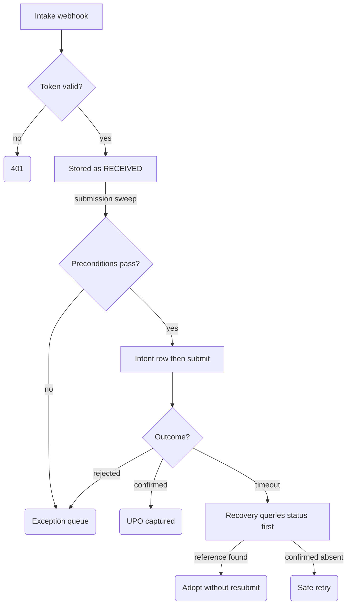

# KSeF Exception Desk

Exception handling for invoice submissions to KSeF, Poland's mandatory national e-invoicing system, where a nervous double-click means a second legally registered document you cannot recall. Built for finance teams with real invoice volume: it validates invoices, records intent before every submission attempt, and when an outcome is ambiguous it queries status before ever retrying. Includes an auth adapter seam designed for the 2027 qualified-certificate transition.

## What it does

- **Intake** — `POST /webhook/ksef-intake` validates a token from `$vars.KSEF_INTAKE_TOKEN` (fails closed with `401` if the variable is unset), persists the invoice as `RECEIVED` in `KSeF_Lifecycle`, and responds. The intake path only persists — it has no route to the submit node.
- **Submission sweep** (manual trigger) — reads the lifecycle table back as a guard, runs preconditions per invoice: required fields and XML shape, NIP checksum, VAT-whitelist status, two-person approval above a gross-amount threshold, auth adapter check. Passing invoices get an `INTENT_PERSISTED` row written *before* the submit adapter runs.
- **Outcomes** — each attempt lands in an explicit state: `UPO_CAPTURED` (confirmed), `UNKNOWN_OUTCOME` (timeout — not guessed as success or failure), `VALIDATION_REJECTED`, `APPROVAL_REQUIRED`, `AUTH_ADAPTER_BLOCKED`, `INCIDENT_LOCKOUT` / `BREAKER_OPEN_QUEUED` (429 cascade). Every transition appends to an evidence log; failures also enqueue an exception row with a Polish correction message for the operator.
- **Recovery sweep** (manual trigger + 30-minute schedule) — picks up unresolved states, queries submission status by `client_submission_id` first, and only then acts: adopts a remote reference with zero new submit calls, retries only after a `NOT_FOUND` status, self-repairs pending UPO rows. Sends a throttled ops alert (Gmail) when unresolved items age past the window.

## Flow

## Design decisions

- **Query-before-retry.** An ambiguous submission (`UNKNOWN_OUTCOME`, crash mid-flight) is never blindly resubmitted. The recovery sweep asks for remote status first; runtime proofs distinguish "adopted existing reference, `submit_call_count=0`" from "confirmed absent, safe to retry" (`Run Durable Recovery Sweep`).
- **Intent before side effect.** A durable `intent_before_submit` row with a stable `submission_attempt_key` is inserted before the submit adapter runs (`Insert Durable Entry State Rows` → `Run Mock Submit After Durable Intent`), so a crash between intent and submit is recoverable instead of invisible.
- **Idempotency on legal identity.** The invoice key is `sha256(seller_nip | invoice_number)` — the identity KSeF cares about. A second invoice with the same identity (changed amount or currency) routes to `CORRECTION_REQUIRED_SAME_LEGAL_IDENTITY` for a human, never a second submission (`Plan Durable Entry Guard`).
- **Circuit breaker on rate limiting.** A 429 cascade opens a breaker (`breaker_open_until` in workflow static data); while open, other invoices queue as `BREAKER_OPEN_QUEUED` with zero submit calls instead of hammering a struggling endpoint.
- **Auth adapter seam for 2027.** `getSessionAuthContext` resolves the token-based path today and fails closed (`AUTH_ADAPTER_BLOCKED`) on the `certificate_2027_config_path`, so the qualified-certificate switch is a config change with a proven failure mode, not a rewrite.

## Setup

1. Import `workflow.json` (n8n → Workflows → Import from File). Keep it inactive.
2. Create four Data Tables — `KSeF_Lifecycle`, `KSeF_Evidence_Log`, `KSeF_Exception_Queue`, `KSeF_Run_Summaries` — with the columns listed in the corresponding insert nodes, then re-point every Data Table node to your table IDs (the IDs in the JSON are instance-specific).
3. Create the n8n variable `KSEF_INTAKE_TOKEN` (requires a plan with Variables; without it the webhook correctly rejects everything).
4. Attach your Gmail credential to the two send nodes and replace `ops@example.com` with your ops inbox. The template ships without credentials.
5. Safe test: send the token as the `x-ksef-token` header (a `Bearer` Authorization header also works). `curl -X POST .../webhook/ksef-intake` with a wrong token and expect a `401` fail-closed body; then send a valid invoice payload and check for a `RECEIVED` lifecycle row with no submission. Run the submission and recovery manual triggers and inspect the four tables — the sweep exercises a built-in scenario suite (happy path, timeout, crash-after-intent, 429, bad NIP, injection attempt) against a local mock.

## Limits

- **It does not call the real KSeF API.** The submit and status-query steps run against a built-in mock implementing the KSeF contract shapes (references, UPO, 429, timeouts). Wiring the production API, credentials, and the qualified certificate is your integration work — the state machine is what this template provides.
- The submission sweep is seeded with fixed test scenarios (T01–T14, pinned timestamps and synthetic NIPs — `9999999999`/`1111111111` pass the checksum by construction and belong to no real entity) to make the failure modes reproducible; replace the fixture block in `Plan Durable Entry Guard` with your real invoice source.
- Duplicate protection uses Data Table read-backs plus workflow static data, not an atomic lock — two truly concurrent sweep runs are not serialized. Run one sweep at a time.
