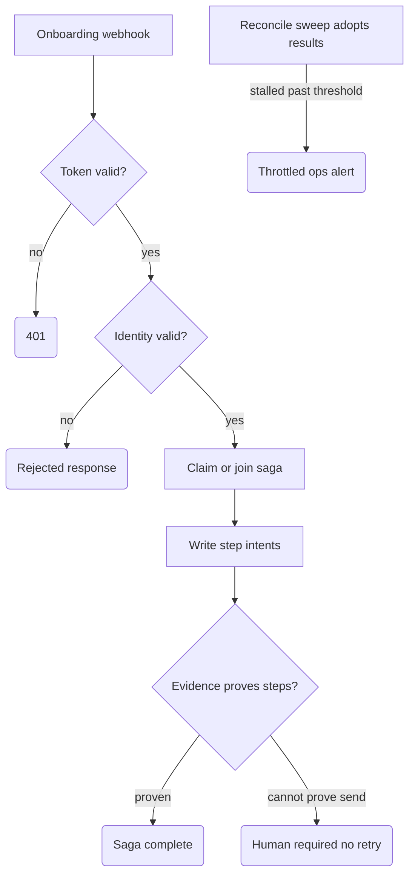

# Client Onboarding Saga

Saga-pattern orchestration for B2B client onboarding: one intake ("we're onboarding client X") becomes a parent saga that tracks the offer, the first invoice, the kickoff booking, and the signed document as steps of a single case with durable state. If the same intake arrives twice, the saga completes what's missing and re-sends nothing. Built for service firms where onboarding crosses three tools and three people and nobody can say what state a given client is in.

## What it does

- **Intake** — `POST /webhook/client-onboarding` validates a token from `$vars.ONBOARDING_INTAKE_TOKEN` (fails closed with `401`), then normalizes the payload: requires a stable identity (`deal_id`, fallback `client_external_id` — free-text company names are rejected), a verified email, a known service code, and timezone-explicit kickoff slot timestamps (`Normalize Onboarding`).
- **Claim** — looks up `Onboardings` and inserts a claim row only if the saga doesn't already exist, so a duplicate delivery joins the existing case instead of starting a second one.
- **Step intents** — plans up to six steps (offer out, first invoice, kickoff booking, signed document, welcome-email record, internal-checklist record) and writes `INTENT_WRITTEN` rows to `Onboarding_Steps` only for steps that don't already have a row.
- **Evidence-based completion** — for each step, reads the step's *own* result table (`Quote_Offers`, `Dunning_Invoices`, `Bookings`, `Intake_Documents`) by a predicted deterministic key and classifies: `TERMINAL_SUCCESS`, `TERMINAL_REVIEW`, `HUMAN_REQUIRED` (e.g. reschedule detected), or `UNKNOWN_CHILD_RESULT` when the evidence cannot prove nothing was sent. The parent state rolls up to `COMPLETE` / `HUMAN_REQUIRED` / `PARTIAL_BLOCKED` / `UNKNOWN_CHILD_RESULT` and is written back with a step-by-step summary.
- **Reconcile sweep** — a 30-minute schedule re-reads everything in UTC, adopts step results that landed after the webhook run, and raises age-based alerts (stalled claim, stalled intent, missing kickoff slot or document, global stuck threshold) to a throttled ops email.

## Flow

## Design decisions

- **Intent rows before side effects, evidence before completion.** A step is recorded as intended before any work is attributed to it, and it is marked done only when a row in the step's own result table proves it — the parent never marks work complete on faith (`Insert Step Intent Rows`, `Build Parent Saga Decisions`).
- **"Cannot prove no send" blocks retries.** Each step carries a `side_effect_policy` (`cannot_unsend_offer`, `cannot_unsend_invoice`, …). An ambiguous result classifies as `UNKNOWN_CHILD_RESULT` with `retry_legal: false` — a human resolves it, because retrying might email a client twice.
- **Deterministic keys end-to-end.** `onboarding_id = sha256("onboarding.v1\n" + stable identity)`; each `step_key` hashes onboarding id, step name/version, step-workflow version, and a snapshot hash of the exact request; each predicted result key is derived from the same request snapshot. Replays regenerate identical keys and match existing rows instead of forking new ones.
- **Operational identity is server-owned.** The saga tag and child-workflow versions come from n8n variables (or the pinned defaults in `Normalize Onboarding`), not from the webhook body. Caller-supplied `smoke_tag`, `child_versions`, `child_fixtures`, and `test_mode` are ignored in normal mode and excluded from the canonical payload hash, so changing them cannot fork a claim or its step keys.
- **Replay is an explicit no-op.** A second identical webhook for a completed saga is detected (`replay_noop`) and skips even the final state write — zero new rows, zero sends, and the response says so.
- **Alert throttle consumed only after a confirmed send.** The alert intent row is inserted first, but `throttle_consumed` flips only when the Gmail node returns a message id (`Build Alert Sent Update`) — a failed send doesn't suppress the next alert, and a sent alert isn't repeated within its UTC-day bucket.

## Setup

1. Import `workflow.json`; keep it inactive.
2. Create Data Tables `Onboardings`, `Onboarding_Steps`, `Onboarding_Reconcile_Alerts` with the columns from the insert/update nodes, plus the four step-result tables (`Quote_Offers`, `Dunning_Invoices`, `Bookings`, `Intake_Documents` — read-only here; workflows 01–03 of this repo cover several of them). Re-point all Data Table nodes to your table IDs.
3. Create the n8n variable `ONBOARDING_INTAKE_TOKEN` (requires Variables support). Optionally set the server-owned operational values `ONBOARDING_SMOKE_TAG`, `ONBOARDING_CHILD_OFFER_VERSION`, `ONBOARDING_CHILD_INVOICE_VERSION`, `ONBOARDING_CHILD_BOOKING_VERSION`, and `ONBOARDING_CHILD_DOCUMENT_VERSION`; otherwise the pinned defaults in `Normalize Onboarding` are used.
4. Attach a Gmail credential to `Send Controlled Reconcile Alert` and replace `ops@example.com`.
5. Safe test: send the token as the `x-onboarding-token` header (`Bearer` also accepted). POST with a wrong token → expect `401`; POST a valid body with a `deal_id`, verified email, service code, and ISO kickoff slot → inspect the claim and intent rows; POST the identical body again → confirm no new rows.
6. Fixture-only test path (disabled by default): set the server variable `ONBOARDING_ALLOW_TEST_OVERRIDES=true`, send `x-onboarding-test-mode: fixtures`, and include `"test_mode": true` plus a `smoke_tag` beginning with `TEST-FIX` or `TEST-DRAFT`. Only when all three gates are present may the body supply known `child_versions` keys or a `child_fixtures` object. Remove the server variable or give it any value other than `true` to fail closed.

## Limits

- **The parent does not invoke the step workflows.** It writes intents and adopts results from the step-owned tables; the offer, invoice, booking, and document workflows must exist and write those tables themselves. Without them, steps sit honestly in `UNKNOWN_CHILD_RESULT` / intent states.
- Test overrides are a local fixture aid, not a production API. Keep `ONBOARDING_ALLOW_TEST_OVERRIDES` unset in production; a request cannot enable the path without that server-side variable.
- The `welcome_email` and `internal_checklist` steps are record-only — no welcome email is sent and no checklist is populated; they exist so the case file is complete.
- Step and reconcile lookups read full tables and filter in code — fine at SME volume, but a Data Table with tens of thousands of rows will make the sweep the bottleneck.
- Post-start changes — offer corrections, invoice credit notes, reschedules — are detected and routed to a human (`HUMAN_REQUIRED`); the saga has no automatic compensation logic. Claim-row dedup is a table read-back, not an atomic lock, so simultaneous first deliveries within the same instant are not serialized.
