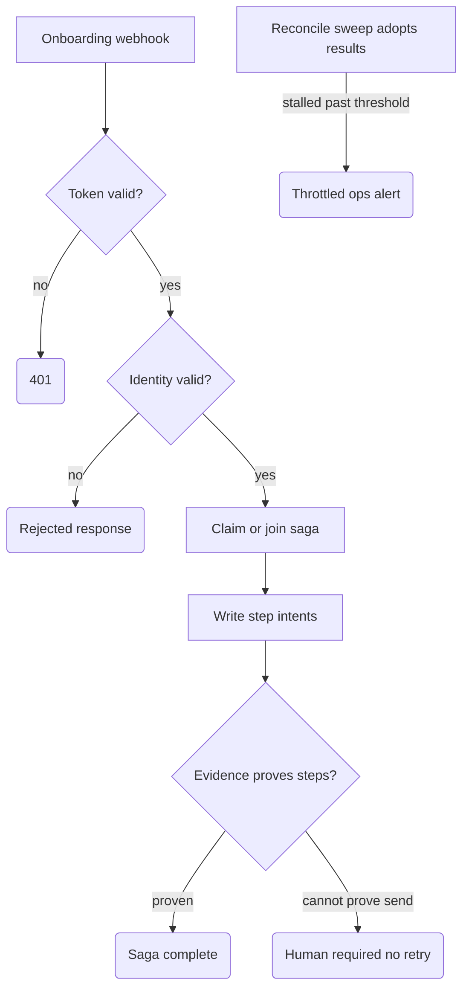

# Client Onboarding Saga

Saga-pattern orchestration for B2B client onboarding: one intake ("we're onboarding client X") becomes a parent saga that tracks the offer, the first invoice, the kickoff booking, and the signed document as steps of a single case with durable state. If the same intake arrives twice, the saga completes what's missing and re-sends nothing. Built for service firms where onboarding crosses three tools and three people and nobody can say what state a given client is in.

## What it does

- **Intake** — `POST /webhook/client-onboarding` validates a token from `$vars.ONBOARDING_INTAKE_TOKEN` (fails closed with `401`), then normalizes the payload: requires a string stable identity (`deal_id`, fallback `client_external_id`, at most 256 raw characters — free-text company names are rejected), a verified email, a known service code, and timezone-explicit kickoff slot timestamps (`Normalize Onboarding`). A malformed supplied identity field fails closed even if the other identity source is valid.
- **Claim** — looks up `Onboardings` and inserts a claim row only if the saga doesn't already exist, so a duplicate delivery joins the existing case instead of starting a second one.
- **Step intents** — plans six steps (offer out, first invoice, kickoff booking, signed document, welcome-email record, internal-checklist record) and writes rows to `Onboarding_Steps` only for steps that don't already have a row. A child request is dispatchable only in `INTENT_WRITTEN`; contract failures stay `PRECONDITION_FAILED` (or `DOC_WAITING_UPLOAD`) with no predicted child key.
- **Evidence-based completion** — for each step, reads the step's *own* result table (`Quote_Offers`, `Dunning_Invoices`, `Bookings`, `Intake_Documents`) by a predicted deterministic key and classifies every exact match rather than selecting the first row returned. Every Offer, Invoice, Booking, and Document evidence row must carry the exact step `onboarding_id` and `smoke_tag`; a missing or mismatched owner or tag fails closed. Duplicate results are resolved independently of table order with the fixed precedence `TERMINAL_DEAD_LETTER` → `HUMAN_REQUIRED` → `TERMINAL_REVIEW` → `UNKNOWN_CHILD_RESULT` → `TERMINAL_SUCCESS`; a terminal/nonterminal conflict stays `UNKNOWN_CHILD_RESULT`, and retry is legal only when every matched row independently proves failure before send. Aggregate proof adds the match count and a sorted classification-count summary without copying raw result rows or arbitrary result fields. The parent state rolls up to `COMPLETE` / `HUMAN_REQUIRED` / `PARTIAL_BLOCKED` / `UNKNOWN_CHILD_RESULT` and is written back with a step-by-step summary.
- **Reconcile sweep** — a 30-minute schedule re-reads everything in UTC, uses the same aggregate evidence resolver as the webhook, and evidence-rechecks `UNKNOWN_CHILD_RESULT` plus stored external-child success/review/dead-letter states without resending any child action. It adopts deterministic late success/review/dead-letter decisions, corrects a formerly successful step when later same-key evidence conflicts, persists matched ambiguous conflicts as unresolved with `retry_legal: false`, and only after the step updates recomputes each affected parent in isolation. Stored terminal steps with no current exact evidence, terminal steps whose aggregate state is unchanged, and `HUMAN_REQUIRED` steps remain no-ops. `CANCELLED` is irreversible within the exact `onboarding_id` plus `smoke_tag` scope: any cancelled physical parent row overrides stale non-cancelled duplicates, suppressing step evidence adoption, repair triggers, alerts, and parent rollups; the rollup node independently rejects injected rows for that scope. It also raises age-based alerts (stalled claim, stalled intent, missing kickoff slot or document, global stuck threshold) to a throttled ops email.

## Flow

## Design decisions

- **Intent rows before side effects, evidence before completion.** A step is recorded as intended before any work is attributed to it, and it is marked done only when a row in the step's own result table proves it — the parent never marks work complete on faith (`Insert Step Intent Rows`, `Build Parent Saga Decisions`).
- **Read-before-plan and persistence acknowledgement are fail-stop.** `Find Existing Onboarding Rows` stops the workflow on a Data Table read error before `Build Claim Decision`, so a failed parent read cannot pass the normalized intake through as if no persisted parent existed, hide an exact `CANCELLED` row, and recreate all six intents. `Find Existing Step Rows` likewise stops before missing-step planning, so a failed step read cannot be mistaken for an empty table. Both reads retain `alwaysOutputData`, which lets a successful legitimate zero-row read continue to the first-delivery plan. `Insert Onboarding Claim Row`, `Insert Step Intent Rows`, `Update Step Terminal Rows`, and `Update Final Onboarding Row` likewise stop the workflow on a Data Table error. None may pass an error item along normal output, because downstream builders reconstruct decisions from planned or named-node data and could otherwise reach `Respond Accepted` without the required read or write. A successful write continues through the existing normal edge; a legitimate replay or branch with no row to write still skips the write node and returns normally.
- **A partial step-before-parent write repairs durably.** The step update and parent update are separate fail-stop writes, so a process failure can leave a corrected step beside a stale parent. Every webhook decision compares its deterministic state, blocked reason, and bounded step summary with all persisted parent rows in the exact `onboarding_id` plus `smoke_tag` scope; it is a no-op only when the step needs no write and that parent projection already matches. Reconcile performs the same comparison even when no child evidence is newly adopted. For each divergent non-cancelled scope it emits one deterministic `parent_repair_trigger` step through the existing step-update → parent-rollup chain, without dispatching a child action; evidence adoptions and repair triggers remain separately counted. After the parent write is durable, the identical webhook and reconcile sweep emit no further repair. This also repairs stale `COMPLETE` parents when distinct step identities require human review.
- **"Cannot prove no send" blocks retries, not evidence checks.** Each step carries a `side_effect_policy` (`cannot_unsend_offer`, `cannot_unsend_invoice`, …). An ambiguous result classifies as `UNKNOWN_CHILD_RESULT` with `retry_legal: false`, so the saga never repeats the child side effect. Webhook replay and reconciliation may still read the deterministic result key and adopt evidence that arrived late.
- **Conflicting evidence fails closed.** Non-atomic child inserts can leave more than one row for a deterministic key, so both decision paths classify all matching rows and resolve their aggregate by the same fixed precedence. Exact duplicate successes remain successful. Review, human-required, or dead-letter evidence outranks success; any mix of terminal and nonterminal evidence remains unresolved; and mixed retry evidence cannot authorize another attempt. Aggregate proofs contain `evidence_match_count`, sorted `evidence_classifications`, and the resolution rule without copying raw child rows.
- **Duplicate step identities require review.** Within one `onboarding_id` plus `smoke_tag`, repeated physical rows for the same `step_key` are one logical step and collapse deterministically. If one required `step_name` instead has different step keys, webhook discovery and reconcile preserve every distinct identity and route the parent to `HUMAN_REQUIRED` with `duplicate_step_identity_conflict:<step_name>`; neither lexical key order nor table order may choose a winner. Reconcile suppresses evidence adoption for every identity under that conflicting name, even when evidence matches exactly one key, and uses the existing parent-repair path to persist the fail-closed projection. The bounded parent summary retains each identity's `step_key`, `predicted_child_key`, state, and status as proof references, but omits request snapshots and raw child evidence. This policy emits no child resend, and a repeated sweep is a no-op once the parent projection is durable.
- **Deterministic keys end-to-end.** A `deal_id` keeps the legacy formula `onboarding_id = sha256("onboarding.v1\n" + deal_id)`. The fallback is domain-separated as `onboarding_id = sha256("onboarding.client_external_id.v1\n" + client_external_id)`. Each child request snapshot carries that owner plus the server-owned `smoke_tag`; each `step_key` hashes onboarding id, step name/version, step-workflow version, and a snapshot hash of the exact request. The predicted Offer, Invoice, Booking, and Document business keys retain their existing formulas and do not vary by tag. Per-source replays regenerate identical keys and match existing rows in the exact owner/tag scope instead of forking new business identities.
- **Identity migration.** Existing `deal_id` onboarding ids remain stable. Older `client_external_id`-only rows used the legacy `onboarding.v1` namespace; allow those sagas to finish or retire them before adopting this template, so the new fallback namespace cannot start a second live saga for the same external identity.
- **Child contracts are validated before intent.** Invoice requests are complete `job.completed` events. The only onboarding-to-price-book mappings are `ai_audit → automation_audit` (quantity 1), `automation_retainer → support_retainer` (quantity 1–6), and `workflow_build → workflow_build` (quantity 1–3). `ops_sprint` deliberately becomes a non-dispatchable invoice `PRECONDITION_FAILED`; no price or mapping is guessed. Document filename, MIME, attachment/hash, and OCR-text aliases must be strings when supplied; filename/attachment are limited to 180 raw characters, MIME to 120, and file hashes to exact 64-hex strings. Every supplied `ocr_confidence` / `ocrConfidence` and `scan_text_ratio` / `scanTextRatio` alias must be a finite JavaScript number in `[0,1]`; missing metrics default to numeric `0`, while any invalid alias fails only the signed-document precondition. Missing, overlong, wrong-type, or malformed document fields never become document intents, while unrelated valid steps retain their keys.
- **Offer adapter scope is explicit.** The offer request includes `onboarding_id` and `smoke_tag`, and its predicted submission id is `sha256(lowercase(onboarding_id + "\n" + email + "\n" + service_code + "\n" + quantity + "\n" + request_details))`. The external offer adapter must use this request identity and persist the exact owner and tag beside `submission_id` / `offer_submission_id` in `Quote_Offers`; otherwise the parent will not adopt the row.
- **Invoice adapter scope is explicit.** The invoice request includes the exact `onboarding_id` and `smoke_tag`, while the predicted invoice key remains `sha256("invoice.v1\n" + job_id)`. Workflow 02 validates and persists both fields, and scopes completion claims, persistent duplicate checks, and dunning rechecks by the exact invoice-key/owner/tag triple.
- **Booking adapter scope is explicit.** The booking request includes the exact `onboarding_id` and `smoke_tag`, while its deterministic `booking_uid` remains unchanged. The external booking adapter must persist both fields beside that key in `Bookings`; workflow 04 in this repository is Support Triage and is not a booking-table producer.
- **Document adapter scope is explicit.** The document request includes `onboarding_id` and `smoke_tag`. Its predicted key exactly matches workflow 03: `sha256("doc-intake\n" + onboarding_id + "\n" + document_seed)`, where the seed is the unchanged normalized file SHA-256 or `JSON.stringify(["attachment.v2", attachment_id, filename, mime_type])`. Workflow 03 persists both scope fields beside `document_key` and deduplicates their exact triple.
- **Attachment-key migration.** Existing attachment-id-only rows used the delimiter-based v1 seed. Let those sagas finish or retire them before adopting this template; file-SHA-based document keys are unchanged.
- **Operational identity is server-owned.** The saga tag and child-workflow versions come from n8n variables (or the pinned defaults in `Normalize Onboarding`), not from the webhook body. A configured tag is a raw identifier: it is never trimmed or coerced, and any non-string, padding, whitespace/control character, or overlong value fails the whole plan before an external child is dispatchable. Caller-supplied `smoke_tag`, `child_versions`, `child_fixtures`, and `test_mode` are ignored in normal mode and excluded from the canonical payload hash, so changing them cannot fork a claim or its step keys.
- **Replay is an explicit no-op when evidence is unchanged.** A second identical webhook for a completed saga skips even the final state write when its external-child evidence aggregate has not changed — zero new rows, zero sends, and the response says so.
- **Late evidence can invalidate a completed replay.** Before accepting the completed-saga no-op, the webhook reaggregates current exact-key evidence for stored external-child success/review/dead-letter steps. An unchanged terminal aggregate (including duplicate successes), or no current matching row, keeps the replay as a zero-write no-op. A newly conflicting aggregate emits the corrective step update, recomputes the affected parent, and reports `replay_noop: false`; parent-owned, registry-blocked, precondition, slot-wait, and document-wait steps retain their existing semantics. `HUMAN_REQUIRED` is sticky until explicit human resolution: old confirmed-slot evidence cannot automatically undo a booking reschedule decision.
- **Cancellation also wins every webhook replay and parent-write race.** If any exact `onboarding_id` plus `smoke_tag` parent row is `CANCELLED`, the claim deterministically selects the latest persisted cancelled snapshot (with a stable full-row tie break), emits no missing step intents or terminal step updates, performs no parent rewrite, and returns that cancellation and its stored `blocked_reason`. The parent decision node repeats this guard independently before inspecting child evidence, so a stale active duplicate or adversarial intermediate summary cannot revive the saga. Both webhook and reconcile parent Data Table updates atomically add `state != CANCELLED` to their exact owner/tag match. A cancellation persisted after the read but before either write therefore matches zero rows and is never overwritten. Neither updater forces output or has an alternate/error bypass, so a zero-row webhook update emits no item for the existing success edge to carry into the response path, while the reconcile updater remains terminal; the stale attempt fails closed, and a later webhook replay re-reads and returns the persisted `CANCELLED` row.
- **Terminal step updates preserve run scope.** Webhook terminal writes match `step_key`, `onboarding_id`, and `smoke_tag` together, so an authorized fixture run cannot overwrite the normal row even when both scopes derive the same deterministic step key.
- **Scheduled reconcile requires one complete snapshot.** `Find Reconcile Onboarding Rows`, `Find Reconcile Step Rows`, `Find Reconcile Offer Rows`, `Find Reconcile Invoice Rows`, `Find Reconcile Booking Rows`, and `Find Reconcile Document Rows` all stop the scheduled workflow on a Data Table read error before `Build UTC Reconcile Alerts`. A failed source therefore cannot be mistaken for parent, step, or child evidence and cannot produce an alert intent, reach Gmail, adopt or repair a step, or reach either reconcile writer. All six reads retain `alwaysOutputData`, so a successful legitimate zero-row result still completes the chain and runs the builder. This is intentionally stricter than the webhook's `Find Offer Rows`, `Find Invoice Rows`, `Find Booking Rows`, and `Find Document Rows`: those child evidence reads remain tolerant so a webhook can evaluate the other persisted evidence while unresolved side effects remain non-retryable. Complete-snapshot fail-stop prevents new reconcile alerts from a failed read; it does not remove the separate Gmail-send-success/Data-Table-acknowledgement-failure residual described below.
- **Reconcile writes step before parent.** `Update Reconcile Adopted Step Rows` feeds `Build Reconcile Parent Rollups`; only parents represented by confirmed adopted rows enter the dedicated `Reconcile Parent Updates Needed?` → `Update Reconcile Parent Rows` chain. That chain terminates after the Data Table update and cannot reach the webhook response nodes. Multiple onboardings are grouped by onboarding id plus smoke tag, and a repeated sweep after adoption emits no further step or parent updates.
- **Alert throttle lookup and receipt persistence fail-stop.** `Find Existing Reconcile Alert Rows` stops on a Data Table read failure before `Build UTC Reconcile Alerts`; it retains `alwaysOutputData`, so a healthy legitimate zero-row lookup can still generate the first alert. This fixes the avoidable fail-open case where n8n 2.33.3 could pass the upstream item through, hide an already-consumed key, and resend it. The alert intent row must be inserted successfully before Gmail runs, and `throttle_consumed` flips only when Gmail returns both a message id and thread id (`Build Alert Sent Update`). Insert, send, and `Update Reconcile Alert Sent` failures stop the workflow; passed-through intent rows are rejected, and a failed send doesn't suppress the next alert. A successfully acknowledged receipt prevents another send within its UTC-day bucket. This is not exactly-once delivery: if Gmail accepts the send but the process or Data Table acknowledgement fails afterward, a later sweep may send that key again. That provider-send-success/DB-ack-failure window is the remaining unavoidable at-least-once residual, distinct from the fixed lookup fail-open.

## Setup

1. Import `workflow.json`; keep it inactive.
2. Create Data Tables `Onboardings`, `Onboarding_Steps`, `Onboarding_Reconcile_Alerts` with the columns from the insert/update nodes, plus the four step-result tables (`Quote_Offers`, `Dunning_Invoices`, `Bookings`, `Intake_Documents` — read-only here; workflows 01–03 of this repo cover several of them). All four result tables must include string columns `onboarding_id` and `smoke_tag`; child evidence is adopted only from the exact owner/tag scope. Re-point all Data Table nodes to your table IDs.
3. Create the n8n variable `ONBOARDING_INTAKE_TOKEN` (requires Variables support). Optionally set the server-owned operational values `ONBOARDING_SMOKE_TAG`, `ONBOARDING_CHILD_OFFER_VERSION`, `ONBOARDING_CHILD_INVOICE_VERSION`, `ONBOARDING_CHILD_BOOKING_VERSION`, and `ONBOARDING_CHILD_DOCUMENT_VERSION`; otherwise the pinned defaults in `Normalize Onboarding` are used. Enter `ONBOARDING_SMOKE_TAG` exactly, with no leading/trailing padding, whitespace, or control characters and at most 80 total characters; only an absent or exactly empty value selects `ONBOARDING-DRAFT`. Fixture tags must likewise be exact raw strings matching `TEST-(FIX|DRAFT)` plus at most 64 allowed suffix characters (72 total). Before upgrading, inspect the exported variable value and every fixture producer byte-for-byte: require `value === value.trim()`, no whitespace/control character, and the applicable length/pattern bound. If an old padded value relied on normalization, change it to the exact unpadded tag already stored in parent, step, and request-snapshot `smoke_tag` fields, then verify equality for every in-flight scope before importing this version; if that mapping cannot be proved, finish or explicitly retire the affected scopes instead of creating a second raw spelling.
4. Attach a Gmail credential to `Send Controlled Reconcile Alert` and replace `ops@example.com`.
5. Safe test: send the token as the `x-onboarding-token` header (`Bearer` also accepted). POST with a wrong token → expect `401`; POST a valid body with a `deal_id`, verified email, mapped service code and quantity, ISO kickoff slot, plus document `filename`, supported `mime_type`, `attachment_id` or 64-hex `file_sha256`, non-empty `ocr_text`, `ocr_confidence`, and `scan_text_ratio` → inspect the claim and intent rows; POST the identical body again → confirm no new rows.
6. Fixture-only test path (disabled by default): set the server variable `ONBOARDING_ALLOW_TEST_OVERRIDES=true`, send `x-onboarding-test-mode: fixtures`, and include `"test_mode": true` plus a `smoke_tag` beginning with `TEST-FIX` or `TEST-DRAFT`. Only when all three gates are present may the body supply known `child_versions` keys or a `child_fixtures` object. Remove the server variable or give it any value other than `true` to fail closed.

## Limits

- **The parent does not invoke the step workflows.** It writes intents and adopts results from the step-owned tables; the offer, invoice, booking, and document workflows must exist and write those tables themselves. Without them, steps sit honestly in `UNKNOWN_CHILD_RESULT` / intent states.
- Test overrides are a local fixture aid, not a production API. Keep `ONBOARDING_ALLOW_TEST_OVERRIDES` unset in production; a request cannot enable the path without that server-side variable.
- The `welcome_email` and `internal_checklist` steps are record-only — no welcome email is sent and no checklist is populated; they exist so the case file is complete.
- Step and reconcile lookups read full tables and filter in code — fine at SME volume, but a Data Table with tens of thousands of rows will make the sweep the bottleneck.
- Post-start changes — offer corrections, invoice credit notes, reschedules — are detected and routed to a human (`HUMAN_REQUIRED`); the saga has no automatic compensation logic. Claim-row dedup is a table read-back, not an atomic lock, so simultaneous first deliveries within the same instant are not serialized.
- **Scope migration:** add `onboarding_id` and `smoke_tag` columns to every child result table before importing this version. Workflows 02 and 03 in this repository persist the scope; the Offer and Booking adapters are external and must be upgraded to the contract above. Workflow 04 is not a Booking producer. Never infer a missing tag: historical untagged evidence is invisible to a tagged saga unless it is backfilled from an authoritative preserved request; otherwise leave the step unresolved for human handling. Because the owner/tag fields now participate in all four request snapshots, existing step keys change even though the predicted child business keys do not. Finish or explicitly retire in-flight sagas before adopting the template rather than mixing old intent rows with new snapshots.
